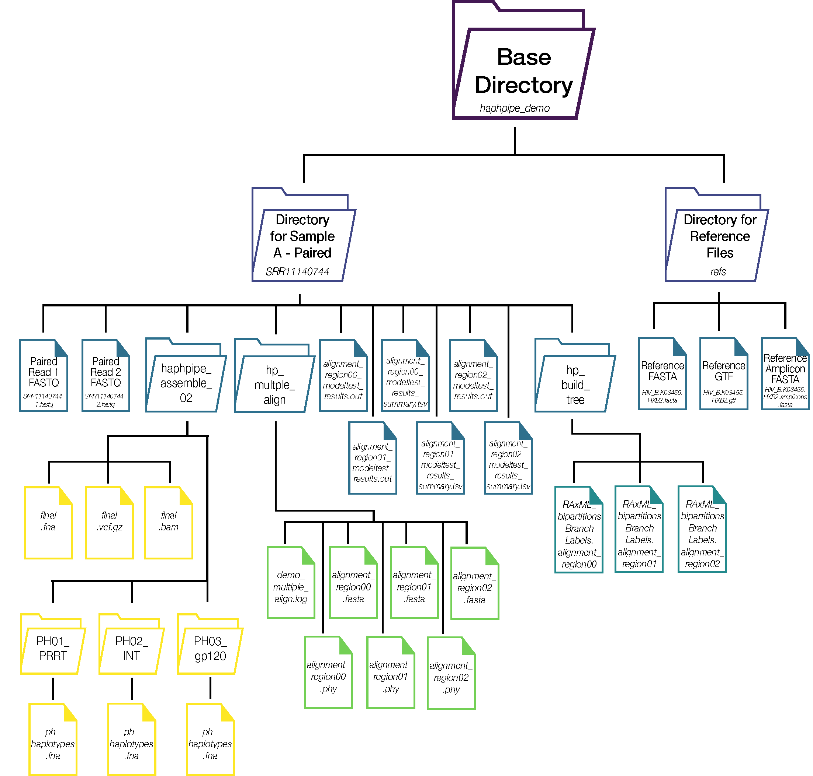

### Demo Module

After successful installation, the demo dataset can be run to ensure HAPHPIPE is installed and set up correctly. 


These are the steps completed in the demo:

1. Download Sample SRR8525886 using fastq-dump
	1. Run `haphpipe_assemble_02`
	2. If PredictHaplo is installed, run PredictHaplo
2. Download Sample SRR8525933 using fastq-dump
	1. Run `haphpipe_assemble_02`
	2. If PredictHaplo is installed, run PredictHaplo
3. Download Sample SRR8525938 using fastq-dump
	1. Run `haphpipe_assemble_02`
	2. If PredictHaplo is installed, run PredictHaplo
5. Download Sample SRR8525939 using fastq-dump
	1. Run `haphpipe_assemble_02`
	2. If PredictHaplo is installed, run PredictHaplo
5. Download Sample SRR8525940 using fastq-dump
 	1. Run `haphpipe_assemble_02`
	2. If PredictHaplo is installed, run PredictHaplo
6. Run multiple sequence alignment with MAFFT
7. Run ModelTest with modeltest-NG
8. Buid a phylogenetic tree with RAxML

We split up the samples, instead of looping through them for fastq-dump because sometimes the fastq-dump/NCBI doesn't work. It was more helpful to see when a sample failed this way rather than a loop for fastq-dump then a loop for running `haphpipe_assemble_02`.  


fastq-dump common error:

```

```

If fastq-dump doesn't work, check your wifi connection, sometimes HPCs have trouble downloading SRA data with the connection. Downloading on own computer should work just fine. If for some reason the fastq-dump doesn't work, you can download directly from the SRA database on a webpage. 

---

#### Description of data used

**Accession numbers:**
SRR8525886, SRR8525933, SRR8525938, SRR8525939,and SRR8525940

These data were first presented in this [paper](https://journals.plos.org/plosone/article/file?type=printable&id=10.1371/journal.pone.0214820). The SRA project data can be found [here](https://www.ncbi.nlm.nih.gov/pubmed/30964884?dopt=Abstract). This data was a part of a cohort study. The viral samples were amplified for three gene regions: *PRRT*, *int*, and *env*. This data was analyzed using HAPHPIPE and PredictHaplo in this [paper](https://www.ncbi.nlm.nih.gov/pubmed/32029767). Results will vary from this 2020 cross-sectional study because here, for the demo, we only use 10,000 reads for each of these 5 samples compared to the study which uses all the available NGS reads.

---

### Running Demo Automatically
Running the demo is simple and requires a single command:
`hp_demo` or `haphpipe demo`

A specific outdirectory can be specified by:
`hp_demo --outdir $outdir_name`

The output of the entire demo is as such



If running the entire demo is not desired, this command can be executed to just pull the references included in HAPHPIPE into the directory that is specified (default outdir is `.`).

`hp_demo --refonly`

Output on the terminal is as such, and the three HIV reference files are located in the subdirectory `refs`. See the [User Guide](https://gwcbi.github.io/haphpipe_docs/install/#reference-files) for more information regarding these reference files.

```
/base/directory/path/of/haphpipe)
Demo was run with --refonly. References are now in outdirectory: $outdir_name/haphpipe_demo/refs.

```
---

#### Output files
If the entire demo is run (i.e., no use of `--refonly`) then these are *all* the files for output **_if_ PredictHaplo is *NOT* installed**. The files are listed for a single sample as example, not all 5 samples. The other files from `multiple_align`, `model_test`, and `build_tree` are all listed.

<details>
  <summary>Directory structure without PH</summary>

```
haphpipe_demo
├── SRR8525886
|   ├── SRR8525886_1.fastq
|   ├── SRR8525886_2.fastq
|   └── haphpipe_assemble_02
|       ├── corrected_1.fastq
|       ├── corrected_2.fastq
|       ├── corrected_U.fastq
|       ├── final.bam
|       ├── final.bam.bai
|       ├── final_bt2.out
|       ├── final.fna
|       ├── final.vcf.gz
|       ├── final.vcf.gz.tbi
|       ├── haphpipe.out
|       ├── refined.01.fna
|       ├── refined.02.fna
|       ├── refined.03.fna
|       ├── refined.fna
|       ├── refined_bt2.01.out
|       ├── refined_bt2.02.out
|       ├── refined_bt2.03.out
|       ├── refined_bt2.out
|       ├── refined_summary.out
|       ├── trimmed_1.fastq
|       ├── trimmed_2.fastq
|       ├── trimmed_U.fastq
|       └── trimmomatic_summary.out
|
├── dir_list.txt
├── haphpipe.out
├── hp_multiple_align
|       ├── alignment_region00.fasta
|       ├── alignment_region00.phy
|       ├── alignment_region01.fasta
|       ├── alignment_region01.phy
|       ├── alignment_region02.fasta
|       ├── alignment_region02.phy
|       ├── all_sequences.fasta
|       ├── all_sequences_region00.fasta
|       ├── all_sequences_region01.fasta
|       └── all_sequences_region02.fasta
|
├── alignment_region00_modeltest_results.out
├── alignment_region00_modeltest_results_summary.tsv
├── alignment_region01_modeltest_results.out
├── alignment_region01_modeltest_results_summary.tsv
├── alignment_region02_modeltest_results.out
├── alignment_region02_modeltest_results_summary.tsv
|
├── hp_build_tree
|       ├── RAxML_bestTree.alignment_region00
|       ├── RAxML_bestTree.alignment_region01
|       ├── RAxML_bipartitions.alignment_region00
|       ├── RAxML_bipartitions.alignment_region01
|       ├── RAxML_bipartitionsBranchLabels.alignment_region00
|       ├── RAxML_bipartitionsBranchLabels.alignment_region01
|       ├── RAxML_bootstrap.alignment_region00
|       ├── RAxML_bootstrap.alignment_region01
|       ├── RAxML_info.alignment_region00
|       └── RAxML_info.alignment_region01
|
├── sample#
|   ├── sample#_1.fastq
|   ├── sample#_2.fastq
|   └── haphpipe_assemble_02
....
```
</details>


<br/>

If the entire demo is run (i.e., no use of `--refonly`) then these are *all* the files for output **_if_ PredictHaplo is installed.**

<details>
  <summary>Directory structure with PH</summary>

```
haphpipe_demo
├── SRR8525886
|   ├── SRR8525886_1.fastq
|   ├── SRR8525886_2.fastq
|   └── haphpipe_assemble_02
|       ├── corrected_1.fastq
|       ├── corrected_2.fastq
|       ├── corrected_U.fastq
|       ├── final.bam
|       ├── final.bam.bai
|       ├── final_bt2.out
|       ├── final.fna
|       ├── final.vcf.gz
|       ├── final.vcf.gz.tbi
|       ├── haphpipe.out
|       ├── refined.01.fna
|       ├── refined.02.fna
|       ├── refined.03.fna
|       ├── refined.fna
|       ├── refined_bt2.01.out
|       ├── refined_bt2.02.out
|       ├── refined_bt2.03.out
|       ├── refined_bt2.out
|       ├── refined_summary.out
|       ├── trimmed_1.fastq
|       ├── trimmed_2.fastq
|       ├── trimmed_U.fastq
|       ├── trimmomatic_summary.out
|       ├── ph_haplotypes_comb.fna
|       ├── PH01_PRRT
|       |	  ├── PH01_PRRT.best_1_1197.fas
|       |	  ├── PH01_PRRT.best_1_1197.html
|       |	  ├── PH01_PRRT.config.log
|       |	  ├── ph_haplotypes.fna
|       |	  └── ph_summary.txt 
|       ├── PH02_INT
|       |	  ├── PH02_INT.best_1_964.fas
|       |	  ├── PH02_INT.best_1_964.html
|       |	  ├── PH02_INT.config.log
|       |	  ├── ph_haplotypes.fna
|       |	  └── ph_summary.txt 
|       └── PH03_gp120
|       	  ├── PH03_gp120.best_1_1641.fas
|       	  ├── PH03_gp120.best_1_1641.html
|       	  ├── PH03_gp120.config.log
|       	  ├── ph_haplotypes.fna
|       	  └── ph_summary.txt 
|
├── dir_list.txt
├── haphpipe.out
├── hp_multiple_align
|       ├── alignment_region00.fasta
|       ├── alignment_region00.phy
|       ├── alignment_region01.fasta
|       ├── alignment_region01.phy
|       ├── alignment_region02.fasta
|       ├── alignment_region02.phy
|       ├── all_sequences.fasta
|       ├── all_sequences_region00.fasta
|       ├── all_sequences_region01.fasta
|       └── all_sequences_region02.fasta
|
├── alignment_region00_modeltest_results.out
├── alignment_region00_modeltest_results_summary.tsv
├── alignment_region01_modeltest_results.out
├── alignment_region01_modeltest_results_summary.tsv
├── alignment_region02_modeltest_results.out
├── alignment_region02_modeltest_results_summary.tsv
|
├── hp_build_tree
|       ├── RAxML_bestTree.alignment_region00
|       ├── RAxML_bestTree.alignment_region01
|       ├── RAxML_bestTree.alignment_region01
|       ├── RAxML_bipartitions.alignment_region00
|       ├── RAxML_bipartitions.alignment_region01
|       ├── RAxML_bipartitions.alignment_region02
|       ├── RAxML_bipartitionsBranchLabels.alignment_region00
|       ├── RAxML_bipartitionsBranchLabels.alignment_region01
|       ├── RAxML_bipartitionsBranchLabels.alignment_region02
|       ├── RAxML_bootstrap.alignment_region00
|       ├── RAxML_bootstrap.alignment_region01
|       ├── RAxML_bootstrap.alignment_region02
|       ├── RAxML_info.alignment_region00
|       ├── RAxML_info.alignment_region01
|       └── RAxML_info.alignment_region02
|
├── sample#
|   ├── sample#_1.fastq
|   ├── sample#_2.fastq
|   └── haphpipe_assemble_02
....
```
</details>

---

### Running Demo Interactively

The demo pipeline bash script:

<details>
  <summary>haphpipe_demo</summary>
  
```bash
#!/usr/bin/env bash

###############################################################################
# Demo pipeline implementing amplicon assembly using a reference-based approach
#(haphpipe_assemble_02). Reads are error-corrected and used to refine
# the initial assembly, with up to 5 refinement steps. PredictHaplo runs if it
# is loaded, and multiple sequence alignment is conducted with the final.fna
# (and haplotypes if there).
###############################################################################
SN=$(basename $0)


read -r -d '' USAGE <<EOF
USAGE:
$SN <outdir>

----- HAPHPIPE demo -----

This demo implements amplicon assembly using a reference-based approach. Five SRA
samples are pulled with fastq-dump, assembled with haphpipe_assemble_02,
multiple aligned and a phylogeny estimated. If PredictHaplo is installed,
haplotypes are also predicted followed by MSA and a phylogeny estimated.

outdir:            Output directory (default is demo)

EOF

#--- Read command line args
[[ -n "$1" ]] && [[ "$1" == '-h' ]] && echo "$USAGE" && exit 0

[[ -n "$1" ]] && outdir="$1"

[[ -z ${outdir+x} ]] && outdir=$SN
mkdir -p $outdir/refs

#--- Determine CPUs to use
# First examines NCPU environment variable, then nproc, finally sets to  1
[[ -n "$NCPU" ]] && ncpu=$NCPU
[[ -z $ncpu ]] && ncpu=$(nproc 2> /dev/null)
[[ -z $ncpu ]] && ncpu=1

#--- Determine whether verbose
[[ -n "$VERBOSE" ]] && quiet="" || quiet='--quiet'

echo "[---$SN---] ($(date)) outdir:            $outdir"
echo "[---$SN---] ($(date)) num CPU:           $ncpu"

#--- Start the timer
t1=$(date +"%s")


### We split up the samples, instead of looping through them for fastq-dump ###
### because sometimes the fastq-dump/NCBI doesn't work. It was more helpful ###
### to see when a sample failed this way rather than a loop for fastq-dump  ###
### then a loop for running haphpipe_assemble_02.                           ###
###############################################################################
# Step 2a: Sample 1: SRR8525886
###############################################################################
# Step 1: Fastq-dump
stage="Demo Sample 1: SRR8525886"
sra='SRR8525886'
echo -e "\n[---$SN---] ($(date)) Stage: $stage"

# checking for the 5 directories and fastq files
if [[ -e ${outdir}/${sra}/${sra}_1.fastq ]] &&\
   [[ -e ${outdir}/${sra}/${sra}_2.fastq ]]; then
    echo "[---$SN---] ($(date)) EXISTS: Demo Sample ${sra} paired fastq files"
else
    read -r -d '' cmd1 <<EOF
fastq-dump --outdir ${outdir}/${sra} \
 --split-files\
 --origfmt\
 --minSpotId 30000\
 --maxSpotId 40000\
 --accession ${sra}
EOF
    echo -e "[---$SN---] ($(date)) $stage for ${sra} command:\n\n$cmd1\n"
    eval $cmd1

    [[ $? -eq 0 ]] && echo "[---$SN---] ($(date)) COMPLETED: $stage" || \
        (  echo "[---$SN---] ($(date)) FAILED: $stage fastq-dump failed for sample ${sra}" && exit 1 )

fi

if
  [[ ! -e ${outdir}/${sra}/${sra}_1.fastq ]] &&\
  [[ ! -e ${outdir}/${sra}/${sra}_2.fastq ]]; then
   echo "[---$SN---] ($(date)) FAILED: file downloading SRA data for ${sra} did not complete" && exit 1

fi

# Step 2: Haphpipe_assemble_02
pipeline="haphpipe_assemble_02"
echo -e "\n[---$SN---] ($(date)) Stage: $pipeline"

# checking for both fastq files and final.fna
if [[ -e ${outdir}/${sra}/${sra}_1.fastq ]] &&\
   [[ -e ${outdir}/${sra}/${sra}_2.fastq ]] &&\
   [[ -e $outdir/${sra}/${pipeline}/final.fna ]]; then
    echo "[---$SN---] ($(date)) EXISTS: $pipeline final.fna for sample ${sra}"
else
   read -r -d '' cmd2 <<EOF
${pipeline} ${outdir}/${sra}/${sra}_1.fastq\
 ${outdir}/${sra}/${sra}_2.fastq\
 ${outdir}/refs/HIV_B.K03455.HXB2.amplicons.fasta\
 ${sra}\
 ${outdir}/${sra}/${pipeline}
EOF
    echo -e "[---$SN---] ($(date)) $pipeline command for ${sra}:\n\n$cmd2\n"
    eval $cmd2

    [[ $? -eq 0 ]] && echo "[---$SN---] ($(date)) COMPLETED: $pipeline for ${sra} samples" || \
        (  echo "[---$SN---] ($(date)) FAILED: $pipeline" && exit 1 )

fi

# Step 3: PredictHaplo
stage="predict_haplo"
echo -e "\n[---$SN---] ($(date)) Stage: $stage"

if [[ -e ${outdir}/${sra}/${pipeline}/ph_haplotypes_comb.fna ]]; then
    echo "[---$SN---] ($(date)) EXISTS: $stage corrected_1.fastq,corrected_2.fastq"
else
 command -v PredictHaplo-Paired >/dev/null 2>&1 ||
 if [[ $? -eq 0 ]] ; then
    echo -e "[---$SN---] ($(date)) $stage PredictHaplo present"
    read -r -d '' cmd1 <<EOF
haphpipe predict_haplo\
 --fq1 ${outdir}/${sra}/${pipeline}/corrected_1.fastq\
 --fq2 ${outdir}/${sra}/${pipeline}/corrected_2.fastq\
 --ref_fa ${outdir}/${sra}/${pipeline}/final.fna\
 --logfile ${outdir}/${sra}/${pipeline}/haphpipe_PH.out\
 --outdir ${outdir}/${sra}/${pipeline}
EOF
    echo -e "[---$SN---] ($(date)) $stage command:\n\n$cmd1\n"
    eval $cmd1

    for ph in ${outdir}/${sra}/${pipeline}/PH*; do
        read -r -d '' cmd2 <<EOF
 haphpipe ph_parser\
 --haplotypes_fa $ph/PH*.best_*.fas\
 --logfile ${outdir}/${sra}/${pipeline}/haphpipe_PH.out\
 --outdir ${ph}\
 --prefix ${sra}_$(basename $ph)
EOF
       echo -e "[---$SN---] ($(date)) $stage command:\n\n$cmd2\n"
       eval $cmd2

       cat ${outdir}/${sra}/${pipeline}/PH*/ph_haplotypes.fna > ${outdir}/${sra}/${pipeline}/ph_haplotypes_comb.fna
     done
 fi

    [[ $? -eq 0 ]] && echo "[---$SN---] ($(date)) COMPLETED: $stage" || \
        (  echo "[---$SN---] ($(date)) FAILED: $stage" && exit 1 )
fi


###############################################################################
# Step 2b: Sample 2: SRR8525933
###############################################################################
# Step 1: Fastq-dump
stage="Demo Sample 2: SRR8525933"
sra='SRR8525933'
echo -e "\n[---$SN---] ($(date)) Stage: $stage"

# checking for the 5 directories and fastq files
if [[ -e ${outdir}/${sra}/${sra}_1.fastq ]] &&\
   [[ -e ${outdir}/${sra}/${sra}_2.fastq ]]; then
    echo "[---$SN---] ($(date)) EXISTS: Demo Sample ${sra} paired fastq files"
else
    read -r -d '' cmd1 <<EOF
fastq-dump --outdir ${outdir}/${sra} \
 --split-files\
 --origfmt\
 --minSpotId 30000\
 --maxSpotId 40000\
 --accession ${sra}
EOF
    echo -e "[---$SN---] ($(date)) $stage for ${sra} command:\n\n$cmd1\n"
    eval $cmd1

    [[ $? -eq 0 ]] && echo "[---$SN---] ($(date)) COMPLETED: $stage" || \
        (  echo "[---$SN---] ($(date)) FAILED: $stage fastq-dump failed for sample ${sra}" && exit 1 )

fi

if
  [[ ! -e ${outdir}/${sra}/${sra}_1.fastq ]] &&\
  [[ ! -e ${outdir}/${sra}/${sra}_2.fastq ]]; then
   echo "[---$SN---] ($(date)) FAILED: file downloading SRA data for ${sra} did not complete" && exit 1

fi

# Step 2: Haphpipe_assemble_02
pipeline="haphpipe_assemble_02"
echo -e "\n[---$SN---] ($(date)) Stage: $pipeline"

# checking for both fastq files and final.fna
if [[ -e ${outdir}/${sra}/${sra}_1.fastq ]] &&\
   [[ -e ${outdir}/${sra}/${sra}_2.fastq ]] &&\
   [[ -e $outdir/${sra}/${pipeline}/final.fna ]]; then
    echo "[---$SN---] ($(date)) EXISTS: $pipeline final.fna for sample ${sra}"
else
   read -r -d '' cmd2 <<EOF
${pipeline} ${outdir}/${sra}/${sra}_1.fastq\
 ${outdir}/${sra}/${sra}_2.fastq\
 ${outdir}/refs/HIV_B.K03455.HXB2.amplicons.fasta\
 ${sra}\
 ${outdir}/${sra}/${pipeline}
EOF
    echo -e "[---$SN---] ($(date)) $pipeline command for ${sra}:\n\n$cmd2\n"
    eval $cmd2

    [[ $? -eq 0 ]] && echo "[---$SN---] ($(date)) COMPLETED: $pipeline for ${sra} samples" || \
        (  echo "[---$SN---] ($(date)) FAILED: $pipeline" && exit 1 )

fi

# Step 3: PredictHaplo
stage="predict_haplo"
echo -e "\n[---$SN---] ($(date)) Stage: $stage"

if [[ -e ${outdir}/${sra}/${pipeline}/ph_haplotypes_comb.fna ]]; then
    echo "[---$SN---] ($(date)) EXISTS: $stage corrected_1.fastq,corrected_2.fastq"
else
 command -v PredictHaplo-Paired >/dev/null 2>&1
 if [[ $? -eq 0 ]] ; then
    echo -e "[---$SN---] ($(date)) $stage PredictHaplo present"
    read -r -d '' cmd1 <<EOF
haphpipe predict_haplo\
 --fq1 ${outdir}/${sra}/${pipeline}/corrected_1.fastq\
 --fq2 ${outdir}/${sra}/${pipeline}/corrected_2.fastq\
 --ref_fa ${outdir}/${sra}/${pipeline}/final.fna\
 --logfile ${outdir}/${sra}/${pipeline}/haphpipe_PH.out\
 --outdir ${outdir}/${sra}/${pipeline}
EOF
    echo -e "[---$SN---] ($(date)) $stage command:\n\n$cmd1\n"
    eval $cmd1

    for ph in ${outdir}/${sra}/${pipeline}/PH*; do
        read -r -d '' cmd2 <<EOF
 haphpipe ph_parser\
 --haplotypes_fa $ph/PH*.best_*.fas\
 --logfile ${outdir}/${sra}/${pipeline}/haphpipe_PH.out\
 --outdir ${ph}\
 --prefix ${sra}_$(basename $ph)
EOF
       echo -e "[---$SN---] ($(date)) $stage command:\n\n$cmd2\n"
       eval $cmd2

       cat ${outdir}/${sra}/${pipeline}/PH*/ph_haplotypes.fna > ${outdir}/${sra}/${pipeline}/ph_haplotypes_comb.fna
    done
 fi

    [[ $? -eq 0 ]] && echo "[---$SN---] ($(date)) COMPLETED: $stage" || \
        (  echo "[---$SN---] ($(date)) FAILED: $stage" && exit 1 )
fi


###############################################################################
# Step 2c: Sample 3: SRR8525938
###############################################################################
# Step 1: Fastq-dump
stage="Demo Sample 1: SRR8525938"
sra='SRR8525938'
echo -e "\n[---$SN---] ($(date)) Stage: $stage"

# checking for the 5 directories and fastq files
if [[ -e ${outdir}/${sra}/${sra}_1.fastq ]] &&\
   [[ -e ${outdir}/${sra}/${sra}_2.fastq ]]; then
    echo "[---$SN---] ($(date)) EXISTS: Demo Sample ${sra} paired fastq files"
else
    read -r -d '' cmd1 <<EOF
fastq-dump --outdir ${outdir}/${sra} \
 --split-files\
 --origfmt\
 --minSpotId 30000\
 --maxSpotId 40000\
 --accession ${sra}
EOF
    echo -e "[---$SN---] ($(date)) $stage for ${sra} command:\n\n$cmd1\n"
    eval $cmd1

    [[ $? -eq 0 ]] && echo "[---$SN---] ($(date)) COMPLETED: $stage" || \
        (  echo "[---$SN---] ($(date)) FAILED: $stage fastq-dump failed for sample ${sra}" && exit 1 )

fi

if
  [[ ! -e ${outdir}/${sra}/${sra}_1.fastq ]] &&\
  [[ ! -e ${outdir}/${sra}/${sra}_2.fastq ]]; then
   echo "[---$SN---] ($(date)) FAILED: file downloading SRA data for ${sra} did not complete" && exit 1

fi

# Step 2: Haphpipe_assemble_02
pipeline="haphpipe_assemble_02"
echo -e "\n[---$SN---] ($(date)) Stage: $pipeline"

# checking for both fastq files and final.fna
if [[ -e ${outdir}/${sra}/${sra}_1.fastq ]] &&\
   [[ -e ${outdir}/${sra}/${sra}_2.fastq ]] &&\
   [[ -e $outdir/${sra}/${pipeline}/final.fna ]]; then
    echo "[---$SN---] ($(date)) EXISTS: $pipeline final.fna for sample ${sra}"
else
   read -r -d '' cmd2 <<EOF
${pipeline} ${outdir}/${sra}/${sra}_1.fastq\
 ${outdir}/${sra}/${sra}_2.fastq\
 ${outdir}/refs/HIV_B.K03455.HXB2.amplicons.fasta\
 ${sra}\
 ${outdir}/${sra}/${pipeline}
EOF
    echo -e "[---$SN---] ($(date)) $pipeline command for ${sra}:\n\n$cmd2\n"
    eval $cmd2

    [[ $? -eq 0 ]] && echo "[---$SN---] ($(date)) COMPLETED: $pipeline for ${sra} samples" || \
        (  echo "[---$SN---] ($(date)) FAILED: $pipeline" && exit 1 )

fi

# Step 3: PredictHaplo
stage="predict_haplo"
echo -e "\n[---$SN---] ($(date)) Stage: $stage"

if [[ -e ${outdir}/${sra}/${pipeline}/ph_haplotypes_comb.fna ]]; then
    echo "[---$SN---] ($(date)) EXISTS: $stage corrected_1.fastq,corrected_2.fastq"
else
 command -v PredictHaplo-Paired >/dev/null 2>&1
 if [[ $? -eq 0 ]] ; then
    echo -e "[---$SN---] ($(date)) $stage PredictHaplo present"
    read -r -d '' cmd1 <<EOF
haphpipe predict_haplo\
 --fq1 ${outdir}/${sra}/${pipeline}/corrected_1.fastq\
 --fq2 ${outdir}/${sra}/${pipeline}/corrected_2.fastq\
 --ref_fa ${outdir}/${sra}/${pipeline}/final.fna\
 --logfile ${outdir}/${sra}/${pipeline}/haphpipe_PH.out\
 --outdir ${outdir}/${sra}/${pipeline}
EOF
    echo -e "[---$SN---] ($(date)) $stage command:\n\n$cmd1\n"
    eval $cmd1

    for ph in ${outdir}/${sra}/${pipeline}/PH*; do
        read -r -d '' cmd2 <<EOF
 haphpipe ph_parser\
 --haplotypes_fa $ph/PH*.best_*.fas\
 --logfile ${outdir}/${sra}/${pipeline}/haphpipe_PH.out\
 --outdir ${ph}\
 --prefix ${sra}_$(basename $ph)
EOF
       echo -e "[---$SN---] ($(date)) $stage command:\n\n$cmd2\n"
       eval $cmd2

       cat ${outdir}/${sra}/${pipeline}/PH*/ph_haplotypes.fna > ${outdir}/${sra}/${pipeline}/ph_haplotypes_comb.fna
    done
 fi

    [[ $? -eq 0 ]] && echo "[---$SN---] ($(date)) COMPLETED: $stage" || \
        (  echo "[---$SN---] ($(date)) FAILED: $stage" && exit 1 )
fi


###############################################################################
# Step 2d: Sample 4: SRR8525939
###############################################################################
# Step 1: Fastq-dump
stage="Demo Sample 1: SRR8525939"
sra='SRR8525939'
echo -e "\n[---$SN---] ($(date)) Stage: $stage"

# checking for the 5 directories and fastq files
if [[ -e ${outdir}/${sra}/${sra}_1.fastq ]] &&\
   [[ -e ${outdir}/${sra}/${sra}_2.fastq ]]; then
    echo "[---$SN---] ($(date)) EXISTS: Demo Sample ${sra} paired fastq files"
else
    read -r -d '' cmd1 <<EOF
fastq-dump --outdir ${outdir}/${sra} \
 --split-files\
 --origfmt\
 --minSpotId 30000\
 --maxSpotId 40000\
 --accession ${sra}
EOF
    echo -e "[---$SN---] ($(date)) $stage for ${sra} command:\n\n$cmd1\n"
    eval $cmd1

    [[ $? -eq 0 ]] && echo "[---$SN---] ($(date)) COMPLETED: $stage" || \
        (  echo "[---$SN---] ($(date)) FAILED: $stage fastq-dump failed for sample ${sra}" && exit 1 )

fi

if
  [[ ! -e ${outdir}/${sra}/${sra}_1.fastq ]] &&\
  [[ ! -e ${outdir}/${sra}/${sra}_2.fastq ]]; then
   echo "[---$SN---] ($(date)) FAILED: file downloading SRA data for ${sra} did not complete" && exit 1

fi

# Step 2: Haphpipe_assemble_02
pipeline="haphpipe_assemble_02"
echo -e "\n[---$SN---] ($(date)) Stage: $pipeline"

# checking for both fastq files and final.fna
if [[ -e ${outdir}/${sra}/${sra}_1.fastq ]] &&\
   [[ -e ${outdir}/${sra}/${sra}_2.fastq ]] &&\
   [[ -e $outdir/${sra}/${pipeline}/final.fna ]]; then
    echo "[---$SN---] ($(date)) EXISTS: $pipeline final.fna for sample ${sra}"
else
   read -r -d '' cmd2 <<EOF
${pipeline} ${outdir}/${sra}/${sra}_1.fastq\
 ${outdir}/${sra}/${sra}_2.fastq\
 ${outdir}/refs/HIV_B.K03455.HXB2.amplicons.fasta\
 ${sra}\
 ${outdir}/${sra}/${pipeline}
EOF
    echo -e "[---$SN---] ($(date)) $pipeline command for ${sra}:\n\n$cmd2\n"
    eval $cmd2

    [[ $? -eq 0 ]] && echo "[---$SN---] ($(date)) COMPLETED: $pipeline for ${sra} samples" || \
        (  echo "[---$SN---] ($(date)) FAILED: $pipeline" && exit 1 )

fi

# Step 3: PredictHaplo
stage="predict_haplo"
echo -e "\n[---$SN---] ($(date)) Stage: $stage"

if [[ -e ${outdir}/${sra}/${pipeline}/ph_haplotypes_comb.fna ]]; then
    echo "[---$SN---] ($(date)) EXISTS: $stage corrected_1.fastq,corrected_2.fastq"
else
 command -v PredictHaplo-Paired >/dev/null 2>&1
 if [[ $? -eq 0 ]] ; then
    echo -e "[---$SN---] ($(date)) $stage PredictHaplo present"
    read -r -d '' cmd1 <<EOF
haphpipe predict_haplo\
 --fq1 ${outdir}/${sra}/${pipeline}/corrected_1.fastq\
 --fq2 ${outdir}/${sra}/${pipeline}/corrected_2.fastq\
 --ref_fa ${outdir}/${sra}/${pipeline}/final.fna\
 --logfile ${outdir}/${sra}/${pipeline}/haphpipe_PH.out\
 --outdir ${outdir}/${sra}/${pipeline}
EOF
    echo -e "[---$SN---] ($(date)) $stage command:\n\n$cmd1\n"
    eval $cmd1

    for ph in ${outdir}/${sra}/${pipeline}/PH*; do
        read -r -d '' cmd2 <<EOF
 haphpipe ph_parser\
 --haplotypes_fa $ph/PH*.best_*.fas\
 --logfile ${outdir}/${sra}/${pipeline}/haphpipe_PH.out\
 --outdir ${ph}\
 --prefix ${sra}_$(basename $ph)
EOF
       echo -e "[---$SN---] ($(date)) $stage command:\n\n$cmd2\n"
       eval $cmd2

       cat ${outdir}/${sra}/${pipeline}/PH*/ph_haplotypes.fna > ${outdir}/${sra}/${pipeline}/ph_haplotypes_comb.fna
    done
 fi

    [[ $? -eq 0 ]] && echo "[---$SN---] ($(date)) COMPLETED: $stage" || \
        (  echo "[---$SN---] ($(date)) FAILED: $stage" && exit 1 )
fi


###############################################################################
# Step 2e: Sample 5: SRR8525940
###############################################################################
# Step 1: Fastq-dump
stage="Demo Sample 1: SRR8525940"
sra='SRR8525940'
echo -e "\n[---$SN---] ($(date)) Stage: $stage"

# checking for the 5 directories and fastq files
if [[ -e ${outdir}/${sra}/${sra}_1.fastq ]] &&\
   [[ -e ${outdir}/${sra}/${sra}_2.fastq ]]; then
    echo "[---$SN---] ($(date)) EXISTS: Demo Sample ${sra} paired fastq files"
else
    read -r -d '' cmd1 <<EOF
fastq-dump --outdir ${outdir}/${sra} \
 --split-files\
 --origfmt\
 --minSpotId 30000\
 --maxSpotId 40000\
 --accession ${sra}
EOF
    echo -e "[---$SN---] ($(date)) $stage for ${sra} command:\n\n$cmd1\n"
    eval $cmd1

    [[ $? -eq 0 ]] && echo "[---$SN---] ($(date)) COMPLETED: $stage" || \
        (  echo "[---$SN---] ($(date)) FAILED: $stage fastq-dump failed for sample ${sra}" && exit 1 )

fi

if
  [[ ! -e ${outdir}/${sra}/${sra}_1.fastq ]] &&\
  [[ ! -e ${outdir}/${sra}/${sra}_2.fastq ]]; then
   echo "[---$SN---] ($(date)) FAILED: file downloading SRA data for ${sra} did not complete" && exit 1

fi

# Step 2: Haphpipe_assemble_02
pipeline="haphpipe_assemble_02"
echo -e "\n[---$SN---] ($(date)) Stage: $pipeline"

# checking for both fastq files and final.fna
if [[ -e ${outdir}/${sra}/${sra}_1.fastq ]] &&\
   [[ -e ${outdir}/${sra}/${sra}_2.fastq ]] &&\
   [[ -e $outdir/${sra}/${pipeline}/final.fna ]]; then
    echo "[---$SN---] ($(date)) EXISTS: $pipeline final.fna for sample ${sra}"
else
   read -r -d '' cmd2 <<EOF
${pipeline} ${outdir}/${sra}/${sra}_1.fastq\
 ${outdir}/${sra}/${sra}_2.fastq\
 ${outdir}/refs/HIV_B.K03455.HXB2.amplicons.fasta\
 ${sra}\
 ${outdir}/${sra}/${pipeline}
EOF
    echo -e "[---$SN---] ($(date)) $pipeline command for ${sra}:\n\n$cmd2\n"
    eval $cmd2

    [[ $? -eq 0 ]] && echo "[---$SN---] ($(date)) COMPLETED: $pipeline for ${sra} samples" || \
        (  echo "[---$SN---] ($(date)) FAILED: $pipeline" && exit 1 )

fi

# Step 3: PredictHaplo
stage="predict_haplo"
echo -e "\n[---$SN---] ($(date)) Stage: $stage"

if [[ -e ${outdir}/${sra}/${pipeline}/ph_haplotypes_comb.fna ]]; then
    echo "[---$SN---] ($(date)) EXISTS: $stage corrected_1.fastq,corrected_2.fastq"
else
 command -v PredictHaplo-Paired >/dev/null 2>&1
 if [[ $? -eq 0 ]] ; then
    echo -e "[---$SN---] ($(date)) $stage PredictHaplo present"
    read -r -d '' cmd1 <<EOF
haphpipe predict_haplo\
 --fq1 ${outdir}/${sra}/${pipeline}/corrected_1.fastq\
 --fq2 ${outdir}/${sra}/${pipeline}/corrected_2.fastq\
 --ref_fa ${outdir}/${sra}/${pipeline}/final.fna\
 --logfile ${outdir}/${sra}/${pipeline}/haphpipe_PH.out\
 --outdir ${outdir}/${sra}/${pipeline}
EOF
    echo -e "[---$SN---] ($(date)) $stage command:\n\n$cmd1\n"
    eval $cmd1

    for ph in ${outdir}/${sra}/${pipeline}/PH*; do
        read -r -d '' cmd2 <<EOF
 haphpipe ph_parser\
 --haplotypes_fa $ph/PH*.best_*.fas\
 --logfile ${outdir}/${sra}/${pipeline}/haphpipe_PH.out\
 --outdir ${ph}\
 --prefix ${sra}_$(basename $ph)
EOF
       echo -e "[---$SN---] ($(date)) $stage command:\n\n$cmd2\n"
       eval $cmd2

       cat ${outdir}/${sra}/${pipeline}/PH*/ph_haplotypes.fna > ${outdir}/${sra}/${pipeline}/ph_haplotypes_comb.fna
    done
 fi

    [[ $? -eq 0 ]] && echo "[---$SN---] ($(date)) COMPLETED: $stage" || \
        (  echo "[---$SN---] ($(date)) FAILED: $stage" && exit 1 )
fi

###############################################################################
# Step 3: Run MSA with MAFFT
###############################################################################

stage="multiple_align"
echo -e "\n[---$SN---] ($(date)) Stage: $stage"

if [[ -e ${outdir}/multiple_align/alignment_region00.fasta ]] &&\
   [[ -e ${outdir}/multiple_align/alignment_region01.fasta ]] &&\
   [[ -e ${outdir}/multiple_align/alignment_region02.fasta ]]; then
    echo "[---$SN---] ($(date)) EXISTS: $stage alignment_region00.fasta,alignment_region01.fasta,alignment_region02.fasta"
else
 # check for PredictHaplo
 command -v PredictHaplo-Paired >/dev/null 2>&1
 if [[ $? -eq 0 ]] ; then
    read -r -d '' cmd1 <<EOF
ls -d ${outdir}/SRR*/${pipeline} > ${outdir}/dir_list.txt &&\
ls -d ${outdir}/SRR*/${pipeline}/PH0* >> ${outdir}/dir_list.txt
EOF
    echo -e "[---$SN---] ($(date)) $stage command:\n\n$cmd1\n"
    eval $cmd1

    read -r -d '' cmd2 <<EOF
haphpipe multiple_align\
 --ncpu $ncpu\
 --dir_list ${outdir}/dir_list.txt\
 --ref_gtf ${outdir}/refs/HIV_B.K03455.HXB2.gtf\
 --logfile haphpipe.out\
 --phylipout\
 --outdir ${outdir}
EOF
    echo -e "[---$SN---] ($(date)) $stage command:\n\n$cmd2\n"
    eval $cmd2

    [[ $? -eq 0 ]] && echo "[---$SN---] ($(date)) COMPLETED: $stage" || \
        (  echo "[---$SN---] ($(date)) FAILED: $stage" && exit 1 )

  # if no PredictHaplo, execute these commands
  else
    read -r -d '' cmd1 <<EOF
ls -d ${outdir}/SRR*/${pipeline} > ${outdir}/dir_list.txt
EOF
    echo -e "[---$SN---] ($(date)) $stage command:\n\n$cmd1\n"
    eval $cmd1

    read -r -d '' cmd2 <<EOF
haphpipe multiple_align\
 --ncpu $ncpu\
 --dir_list ${outdir}/dir_list.txt\
 --ref_gtf ${outdir}/refs/HIV_B.K03455.HXB2.gtf\
 --logfile haphpipe.out\
 --phylipout\
 --outdir ${outdir}
EOF
    echo -e "[---$SN---] ($(date)) $stage command:\n\n$cmd2\n"
    eval $cmd2

    [[ $? -eq 0 ]] && echo "[---$SN---] ($(date)) COMPLETED: $stage" || \
        (  echo "[---$SN---] ($(date)) FAILED: $stage" && exit 1 )
  fi
fi

###############################################################################
# Step 4: ModelTest
###############################################################################
stage="model_test"
echo -e "\n[---$SN---] ($(date)) Stage: $stage"

if [[ -e ${outdir}/alignment_region00_modeltest_results.out ]] &&\
   [[ -e ${outdir}/alignment_region01_modeltest_results.out ]] &&\
   [[ -e ${outdir}/alignment_region02_modeltest_results.out ]]; then
    echo "[---$SN---] ($(date)) EXISTS: $stage alignment_region00_modeltest_results.out,alignment_region01_modeltest_results.out,alignment_region02_modeltest_results.out"
else
    for region in ${outdir}/multiple_align/alignment_region??.fasta; do
        reg=${region%.fasta}
        read -r -d '' cmd <<EOF
haphpipe model_test\
 --seqs ${region}\
 --run_id $(basename $reg)\
 --logfile ${outdir}/haphpipe.out\
 --outdir ${outdir}\
 --template raxml\
 --ncpu ${ncpu}
EOF
        echo -e "[---$SN---] ($(date)) $stage command:\n\n$cmd\n"
        eval $cmd

        [[ $? -eq 0 ]] && echo "[---$SN---] ($(date)) COMPLETED: $stage for $region" || \
            (  echo "[---$SN---] ($(date)) FAILED: $stage for $region" && exit 1 )
    done
fi


###############################################################################
# Step 5: Build tree with RAxML
###############################################################################
stage="build_tree"
echo -e "\n[---$SN---] ($(date)) Stage: $stage"

if [[ -e ${outdir}/build_tree/RAxML_bipartitionsBranchLabels.alignment_region00 ]] &&\
   [[ -e ${outdir}/build_tree/RAxML_bipartitionsBranchLabels.alignment_region01 ]] &&\
   [[ -e ${outdir}/build_tree/RAxML_bipartitionsBranchLabels.alignment_region02 ]]; then
    echo "[---$SN---] ($(date)) EXISTS: $stage RAxML_bipartitionsBranchLabels.alignment_region00, RAxML_bipartitionsBranchLabels.alignment_region01, RAxML_bipartitionsBranchLabels.alignment_region02"
else
    # check for PredictHaplo
    command -v PredictHaplo-Paired >/dev/null 2>&1
    if [[ $? -eq 0 ]] ; then
        for alignment in ${outdir}/multiple_align/alignment_region??.phy; do
            reg=${alignment%.phy}
            read -r -d '' cmd <<EOF
haphpipe build_tree\
 --run_full_analysis\
 --seqs ${alignment}\
 --output_name $(basename $reg)\
 --model GTRGAMMAX\
 --logfile ${outdir}/haphpipe.out\
 --outdir ${outdir}
EOF
            echo -e "[---$SN---] ($(date)) $stage command:\n\n$cmd\n"
            eval $cmd

            [[ $? -eq 0 ]] && echo "[---$SN---] ($(date)) COMPLETED: $stage" || \
                (  echo "[---$SN---] ($(date)) FAILED: $stage" && exit 1 )
        done
    else
        for alignment in ${outdir}/multiple_align/alignment_region00.phy ${outdir}/multiple_align/alignment_region01.phy; do
            reg=${alignment%.phy}
            read -r -d '' cmd <<EOF
haphpipe build_tree\
 --run_full_analysis\
 --seqs ${alignment}\
 --output_name $(basename $reg)\
 --model GTRGAMMAX\
 --logfile ${outdir}/haphpipe.out\
 --outdir ${outdir}
EOF
            echo -e "[---$SN---] ($(date)) $stage command:\n\n$cmd\n"
            eval $cmd

            [[ $? -eq 0 ]] && echo "[---$SN---] ($(date)) COMPLETED: $stage" || \
                (  echo "[---$SN---] ($(date)) FAILED: $stage" && exit 1 )
        done
        echo "region02 did not run because there are only 3 sequences in the alignment"
    fi
fi

#---Complete job
t2=$(date +"%s")
diff=$(($t2-$t1))
echo "[---$SN---] ($(date)) $(($diff / 60)) minutes and $(($diff % 60)) seconds elapsed."
echo "[---$SN---] ($(date)) $SN COMPLETE."
```
</details>

<br/>


The structure of this interactive demo is such:
One sample (SRR8525886) will be used an example, and the single bash command for each step will be shown. 

Step 0: Get the reference data needed for this interactive demo.
```bash
hp_demo --refonly
```


Step 1: Pull sample data from SRA with fastq-dump.

```bash
fastq-dump --outdir haphpipe_demo/SRR8525886 \
 --split-files \
 --origfmt \
 --minSpotId 30000 \
 --maxSpotId 40000 \
 --accession SRR8525886
```

Reminder that the above code is the same as this command on a single line - the `\` just makes it more visually readable.
`fastq-dump --outdir haphpipe_demo/SRR8525886 --split-files --origfmt --minSpotId 30000 --maxSpotId 40000 --accession SRR8525886`

Step 2: Run `haphpipe_assemble_02`

```bash
haphpipe_assemble_02 \
 haphpipe_demo/SRR8525886/SRR8525886_1.fastq \
 haphpipe_demo/SRR8525886/SRR8525886_2.fastq \
 haphpipe_demo/refs/HIV_B.K03455.HXB2.amplicons.fasta \
 SRR8525886 \
 haphpipe_demo/SRR8525886/haphpipe_assemble_02
```

(if PredictHaplo is installed) Step 3a: Run PredictHaplo 

```bash
haphpipe predict_haplo\
 --fq1 haphpipe_demo/SRR8525886/haphpipe_assemble_02/corrected_1.fastq \
 --fq2 haphpipe_demo/SRR8525886/haphpipe_assemble_02/corrected_2.fastq \
 --ref_fa haphpipe_demo/SRR8525886/haphpipe_assemble_02/final.fna \
 --logfile haphpipe_demo/SRR8525886/haphpipe_assemble_02/haphpipe_PH.out \
 --outdir haphpipe_demo/SRR8525886/haphpipe_assemble_02
```

Step 3b: Run PredictHaplo Parser for each amplicon region

Individually:

```bash
# PH01
haphpipe ph_parser \
 --haplotypes_fa haphpipe_demo/SRR8525886/haphpipe_assemble_02/PH01_PRRT/PH*.best_*.fas \
 --logfile haphpipe_demo/SRR8525886/haphpipe_assemble_02/haphpipe_PH.out \
 --outdir haphpipe_demo/SRR8525886/haphpipe_assemble_02/PH01_PRRT \
 --prefix ${sra}_PH01_PRRT

# PH02 
haphpipe ph_parser \
 --haplotypes_fa haphpipe_demo/SRR8525886/haphpipe_assemble_02/PH02_INT/PH*.best_*.fas \
 --logfile haphpipe_demo/SRR8525886/haphpipe_assemble_02/haphpipe_PH.out \
 --outdir haphpipe_demo/SRR8525886/haphpipe_assemble_02/PH02_INT \
 --prefix SRR8525886_PH02_INT


# PH03 
haphpipe ph_parser \
 --haplotypes_fa haphpipe_demo/SRR8525886/haphpipe_assemble_02/PH03_gp120/PH*.best_*.fas \
 --logfile haphpipe_demo/SRR8525886/haphpipe_assemble_02/haphpipe_PH.out \
 --outdir haphpipe_demo/SRR8525886/haphpipe_assemble_02/PH03_gp120 \
 --prefix SRR8525886_PH03_gp120
```

Or you can run ph_parser in a loop for all the haplotype regions:

```bash
for ph in haphpipe_demo/SRR8525886/haphpipe_assemble_02/PH*; do
   haphpipe ph_parser \
   --haplotypes_fa ${ph}/PH*.best_*.fas \
   --logfile $(dirname $ph)/haphpipe_PH.out \
   --outdir ${ph} \
   --prefix SRR8525886_$(basename $ph)
done
```


Step 4: Rerun steps 1-3 for all samples, make sure to replace the accession number.

Step 5: Run multiple sequence alignment using MAFFT.

Make a file with a list of directories containing the `final.fna` files and the `ph_haplotype.fna`:

```bash
ls -d haphpipe_demo/SRR*/haphpipe_assemble_02 > haphpipe_demo/dir_list.txt &&\
ls -d haphpipe_demo/SRR*/haphpipe_assemble_02/PH0* >> haphpipe_demo/dir_list.txt
```

If PredictHaplo was not installed, you only need the first line:
`ls -d haphpipe_demo/SRR*/haphpipe_assemble_02 > haphpipe_demo/dir_list.txt`

Now, run `multiple_align`

```bash
haphpipe multiple_align \
 --ncpu 1 \
 --dir_list haphpipe_demo/dir_list.txt \
 --ref_gtf haphpipe_demo/refs/HIV_B.K03455.HXB2.gtf \
 --logfile haphpipe.out \
 --phylipout \
 --outdir haphpipe_demo
```

Step 6: Estimate best-fit model of evolution using ModelTest-NG

```bash
# Region00 - this is amplicon PRRT
haphpipe model_test \
 --seqs hp_alignments/alignment_region00.fasta \
 --run_id alignment_region00 \
 --logfile haphpipe_demo/haphpipe.out \
 --outdir haphpipe_demo \
 --template raxml \
 --ncpu 1

# Region01 - this is amplicon INT
haphpipe model_test \
 --seqs hp_alignments/alignment_region01.fasta \
 --run_id alignment_region01 \
 --logfile haphpipe_demo/haphpipe.out \
 --outdir haphpipe_demo \
 --template raxml \
 --ncpu 1

# Region02 - this is amplicon gp120
haphpipe model_test \
 --seqs hp_alignments/alignment_region02.fasta \
 --run_id alignment_region02 \
 --logfile haphpipe_demo/haphpipe.out \
 --outdir haphpipe_demo \
 --template raxml \
 --ncpu 1
```

Step 7: Build a phylogenetic tree for each region using RAXML. The models can be changed according to the output of ModelTest (step 6 - above). Here we just show with model GTRGAMMAX.

```bash
# Region00 - this is amplicon PRRT
haphpipe build_tree_NG \
 --all \
 --seqs hp_alignments/alignment_region00.fasta \
 --output_name alignment_region00 \
 --model GTRGAMMAX\
 --logfile haphpipe_demo/haphpipe.out\
 --outdir haphpipe_demo/hp_tree

# Region01 - this is amplicon INT
haphpipe build_tree_NG \
 --all \
 --seqs hp_alignments/alignment_region01.fasta \
 --output_name alignment_region01 \
 --model GTRGAMMAX\
 --logfile haphpipe_demo/haphpipe.out\
 --outdir haphpipe_demo/hp_tree
```

If PredictHaplo is not run, there is not enough taxa - only 3 - to build a tree for region02 gp120.

```bash
# Region02 - this is amplicon gp120
haphpipe build_tree_NG \
 --all \
 --seqs hp_alignments/alignment_region02.fasta \
 --output_name alignment_region02 \
 --model GTRGAMMAX\
 --logfile haphpipe_demo/haphpipe.out\
 --outdir haphpipe_demo/hp_tree
```


