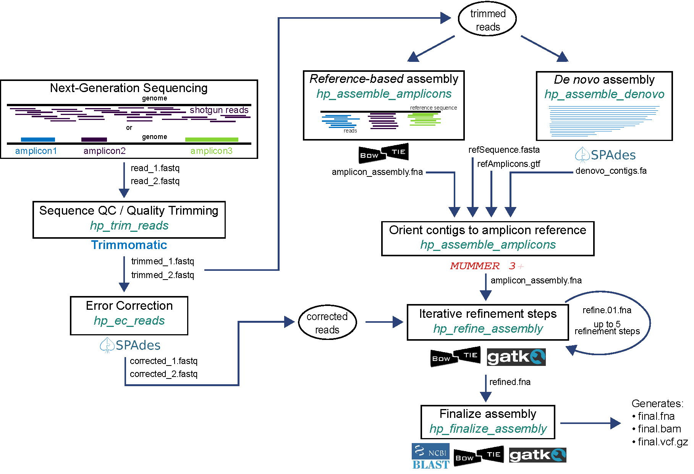

The example pipelines are written in bash scripting language. The reference files used in both examples are included in the demo data. To run in haphpipe, execute one of the following lines:
```
haphpipe_assemble_01 read1.fq.gz read2.fq.gz ../refs/HIV_B.K03455.HXB2.fasta ../refs/HIV_B.K03455.HXB2.gtf sampleID

haphpipe_assemble_02 read1.fq.gz read2.fq.gz ../refs/HIV_B.K03455.HXB2.amplicons.fasta sampleID
```

Pipeline 1 implements amplicon assembly using a *de novo* approach. Reads are
error-corrected and used to refine the initial assembly, with up to 5
refinement steps.

Pipeline 2 implements amplicon assembly using a *reference-based* mapping 
approach. Reads are error-corrected and used to refine the initial assembly,
with up to 5 refinement steps.




### Pipeline 1: __`haphpipe_assemble_01`__

This pipeline implements *de novo* assembly. Reads are first trimmed (*trim_reads*) and used as input for denovo assembly (*assemble_denovo*). The *de novo* assembly stage automatically performs error correction on the trimmed reads. The assembled contigs are used as input for amplicon assembly (*assemble_amplicons*) along with reference FASTA and GTF files. The assembly is then iteratively refined up to five times (*refine_assembly*) by mapping corrected reads to the assembled FASTA file and lastly finalized (*finalize_assembly*), resulting in a FASTA file with final consensus sequences, final VCF, and aligned BAM file.


To see the input information for Pipeline 1, use the `-h` option again like so:
`haphpipe_assemble_01 -h`, and it will show the output:


```
USAGE:
haphpipe_assemble_01 [read1] [read2] [reference_fasta] [reference_gtf] [samp_id] <outdir>

----- HAPHPIPE assembly pipeline 01 -----

This pipeline implements amplicon assembly using a denovo approach. Reads are
error-corrected and used to refine the initial assembly, with up to 5
refinement steps.

Input:
read1:             Fastq file for read 1. May be compressed (.gz)
read2:             Fastq file for read 2. May be compressed (.gz)
reference_fasta:   Reference sequence (fasta)
reference_gtf:     Amplicon regions (GTF)
samp_id:           Sample ID
outdir:            Output directory (default is [sample_dir]/haphpipe_assemble_01)
```

General command to execute pipeline 1:
```
haphpipe_assemble_01 samp/read1.fq.gz samp/read2.fq.gz refs/ref.fasta refs/ref.gtf samp
```

Example command to run with demo samples:
```
haphpipe_assemble_01 SRR8525886/SRR8525886_1.fastq SRR8525886/SRR8525886_2.fastq refs/HIV_B.K03455.HXB2.fasta refs/HIV_B.K03455.HXB2.gtf SRR8525886 SRR8525886
```


### Pipeline 2: __`haphpipe_assemble_02`__

This pipeline implements reference-based mapping assembly. Reads are first trimmed (*trim_reads*) and error-corrected (*ec_reads*). The corrected reads are used as input for reference-based mapping assembly (*refine_assembly*) for up to five iterations. Lastly, the assembly is finalized (*finalize_assembly*) by mapping reads onto the refined reference sequence. The final output is a FASTA file with final consensus sequences, final VCF, and aligned BAM file.

**(insert Figure 2 here)**

To see the input information for Pipeline 1, use the `-h` option again like so:
`haphpipe_assemble_02 -h`, and it will show the output:

```
USAGE:
haphpipe_assemble_02 [read1] [read2] [amplicons_fasta] [samp_id] <outdir>

----- HAPHPIPE assembly pipeline 02 -----

This pipeline implements amplicon assembly using a reference-based approach.
Reads are error-corrected and aligned to provided amplicon reference with up to
five refinement steps.

Input:
read1:             Fastq file for read 1. May be compressed (.gz)
read2:             Fastq file for read 2. May be compressed (.gz)
amplicons_fasta:   Amplicon reference sequence (fasta)
samp_id:           Sample ID
outdir:            Output directory (default is sample_dir/haphpipe_assemble_02)
```

General command to execute pipeline 1:
```
haphpipe_assemble_02 SRR8525886/SRR8525886_1.fastq SRR8525886/SRR8525886_2.fastq refs/HIV_B.K03455.HXB2.amplicons fasta SRR8525886 SRR8525886
```

Example command to run with demo samples:
```
insert
```

</br>
