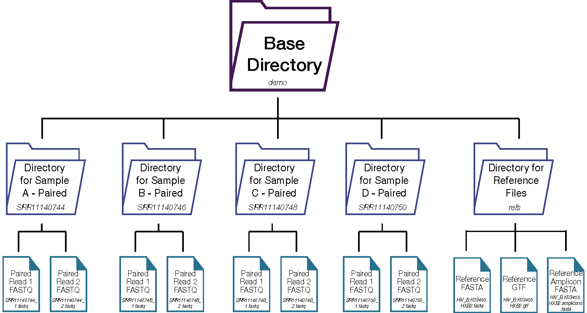

## HAPHPIPE Installation Instructions

HAPHIPE depends on more than a dozen different programs, each of which may itself depend on other programs and libraries. Installing everything separately would be a nightmare, so you should use the package manager "Bioconda" to install everything. Bioconda is a popular package manager in the bioinformatics world. See the Helpful Resources section for more information and resources for Bioconda. Here, we will describe where to get Bioconda and how to install it, then how to use Bioconda to install the necessary programs for HAPHPIPE. We will also detail the acquisition and installation of one program, GATK, that is not handled by Bioconda, and finally the acquisition and installation of HAPHPIPE itself.

Here, we describe the procedure for installing HAPHPIPE using the package manager Bioconda (Grüning et al. 2018) on the command line. If you are unfamiliar with Bioconda, please see [](https://bioconda.github.io) for installation and channel setup. HAPHPIPE is available [here](https://github.com/gwcbi/haphpipe) and is written in Python 3.7.2 coding language. 

The installation process begins with the creation of a conda environment that installs the necessary dependencies required by HAPHPIPE. Once the conda environment has been created, it can be activated for use with the command conda activate haphpipe. Due to license restrictions, Bioconda cannot distribute and install GATK (McKenna et al. 2010; Van der Auwera et al. 2013; Poplin et al. 2018) directly. To fully install GATK, you must download a licensed copy of GATK (version 3.8-0) from the Broad Institute [(link)](https://software.broadinstitute.org/gatk/download/archive). You can then install HAPHPIPE using the single command `pip install git+git://github.com/gwcbi/haphpipe.git`, which pulls the repository from Github.


__1. Install [conda](https://bioconda.github.io/user/install.html#set-up-channels)__

Download the conda package:

```
wget https://repo.anaconda.com/miniconda/Miniconda3-latest-MacOSX-x86_64.sh
sh Miniconda3-latest-MacOSX-x86_64.sh
```

__2. Set up [conda channels](https://bioconda.github.io/user/install.html#set-up-channels)__

These need to be put in as a command in the order they come, as this sets the priority for where packages are pulled from. Therefore, in this order, conda-forge is top priority and explored first when downloading a program.

```
conda config --add channels R
conda config --add channels defaults
conda config --add channels bioconda
conda config --add channels conda-forge
```

__3. Create a conda environment with the following dependencies__

```bash
conda create -n haphpipe \
    python=3.7 \
    future \
    pyyaml \
    biopython \
    seqtk \
    bowtie2 \
    bwa \
    flash \
    freebayes \
    mummer \
    picard \
    trimmomatic \
    samtools=1.9 \
    gatk=3.8 \
    spades \
    blast \
    sierrapy

```

Note: on some HPC systems (including GW's Pegasus), certain dependencies must be installed as a 'User Install'. If this is the case (which will be apparent if you receive availability errors for any of the above packages after installing them through conda) use the following command to install the package:
```
pip install --user <package name>
````

__4. Activate the environment__

```
conda activate haphpipe
```

__5. Install GATK__

Due to license restrictions, bioconda cannot distribute
and install GATK directly. To fully install GATK, you must
download a licensed copy of GATK (version 3.8-0) from the Broad Institute:
[https://software.broadinstitute.org/gatk/download/archive](https://software.broadinstitute.org/gatk/download/archive).

Register the package using gatk3-register:

```
gatk3-register /path/to/GenomeAnalysisTK-3.8-0-ge9d806836.tar.bz2
```

This will copy GATK into your conda environment.

Alternatively, GATK may be installed directly on the command line with the following commands:

```bash
mkdir -p /path/to/gatk_dir
wget -O - 'https://software.broadinstitute.org/gatk/download/auth?package=GATK-archive&version=3.6-0-g89b7209' | tar -xjvC /path/to/gatk_dir
gatk3-register /path/to/gatk_dir/GenomeAnalysisTK.jar
```


NOTE: HAPHPIPE was developed and tested using GATK 3.8.

__6. Install HAPHPIPE__

```
pip install git+git://github.com/gwcbi/haphpipe.git
```

Upon completion of the installation, you can test it to ensure the repository has been installed completely and correctly by running haphpipe -h (in quick start). Once HAPHPIPE is installed and performing correctly, there is no need to install it again; simply activate the conda environment when needed by executing `conda activate haphpipe`. If a new version is released in the future, HAPHPIPE can be updated by running the command line `pip install --upgrade git+git://github.com/gwcbi/haphpipe.git`. At any point, the `-h` option that follows any HAPHPIPE stage will output a help message that provides a description of the stage and the desired input(s) and output(s).

## PredictHaplo Installation Instructions

Users are required to download PredictHaplo on their own computing system prior to running any of the haplotype stages (_hp_predict_haplo_ and _hp_ph_parser_).

Here is how the GW CBI team installed PredictHaplo onto our HPC, which has a slurm scheduling system and uses Lua module files.

We cannot help with the installation of this software, but have provided the code that we used here to install PredictHaplo onto our system. Please see [their website](https://bmda.dmi.unibas.ch/software.html) for contact information if needed.

This module loads predicthaplo onto GWU's HPC - Colonial One. 

See https://bmda.dmi.unibas.ch/software.html

```bash
cd /path/to/modules/predicthaplo

# use gcc 4.9.4, add blas and lapack to library path
module load gcc/4.9.4
module load blas/gcc/64
module load lapack/gcc/64

# download source
cd archive
wget https://bmda.dmi.unibas.ch/software/PredictHaplo-Paired-0.4.tgz
cd ..

# unzip source and change directory name
tar xfvz archive/PredictHaplo-Paired-0.4.tgz
mv PredictHaplo-Paired-0.4 0.4
cd 0.4

# install scythestat
tar xfvz scythestat-1.0.3.tar.gz
cd scythestat-1.0.3
./configure --prefix=/path/to/modules/predicthaplo/0.4/NEWSCYTHE
make install
cd ..

# compile predicthaplo
make
```

<br/>

If a `segfault` error occurs during the _hp_predict_haplo_ stage, this is **not** a characteristic of HAPHPIPE but rather that of PredictHaplo. Sometimes, we have luck if we just rerun the code again or move to an interactive CPU node. We are unsure what causes this error, and we only see it between the local and global reconstruction phases in PredictHaplo.


## Quick start

__1. Activate haphpipe__

Make sure you have conda running.
For students at GW using Colonial One, you need to load the `miniconda3` module like such prior to activating the haphpipe conda environemnt: 
`module load miniconda3`.

```
conda activate haphpipe
```

__2. Test that it is loaded correctly__

```
haphpipe -h
```

should produce:

```
Program: haphpipe (haplotype and phylodynamics pipeline)
Version: 0.8.1

Commands:
 -- Reads
    sample_reads             subsample reads using seqtk
    trim_reads               trim reads using Trimmomatic
    join_reads               join reads using FLASh
    ec_reads                 error correct reads using SPAdes

 -- Assemble
    assemble_denovo          assemble reads denovo
    assemble_amplicons       assemble contigs to amplicon regions
    assemble_scaffold        assemble contigs to genome
    align_reads              align reads to reference
    call_variants            call variants
    vcf_to_consensus         create consensus sequence from VCF
    refine_assembly          iterative refinement: align - variants - consensus
    finalize_assembly        finalize consensus sequence

 -- Haplotype
    predict_haplo            assemble haplotypes with PredictHaplo
    ph_parser                parse output from PredictHaplo.

 -- Annotate
    pairwise_align           align consensus to an annotated reference
    extract_pairwise         extract sequence regions from pairwise alignment
    annotate_from_ref        annotate consensus from reference annotation

 -- Miscellaneous
    demo                     setup demo directory and test data
```

## Directory Structure

Below is the recommended directory structure for using HAPHPIPE:


We recommend creating a separate directory for each sample, as well as a directory for reference files.

## Windows Users

HAPHPIPE is only available for Mac OSX or Linux platforms. We suggest the following options for running HAPHPIPE on a Windows machine:

1. Run HAPHPIPE on your institution's HPC cluster, if available. 

2. Utilize the [Windows Subsystem for Linux](https://docs.microsoft.com/en-us/windows/wsl/install-win10).

3. Run Linux in a virtual machine via [VirtualBox](https://www.virtualbox.org)
